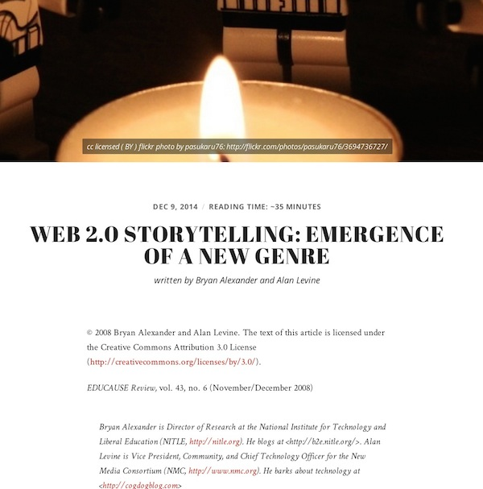
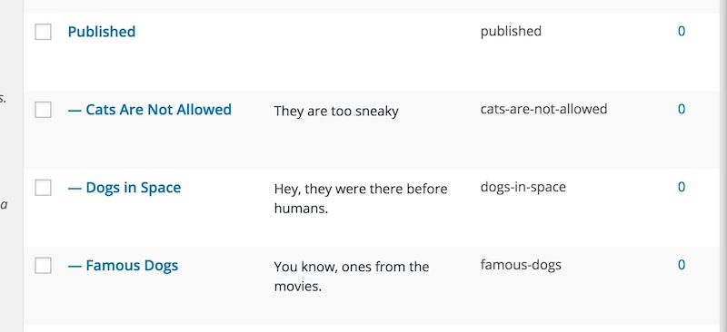
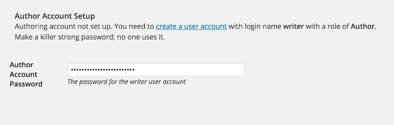

# TRU Writer Wordpress Theme
by Alan Levine http://cogdog.info/ or http://cogdogblog.com/

## What is this?
This Wordpress Theme powers [TRU Writer](http://splot.ca/writer/) a site for rich published writing without logins or needs to learn Wordpress. See [an example created by copy/paste from a Word document](http://splot.ca/writer/2014/101). 

To provide access to advanced editing tools, the site will invisibly log your visitors in to a special account; they will never even know it! They will never know; they will never see the Wordpress interface (we love Wordpress, but hey, not everyone needs to see that dashboard, right?)

You can see other versions of this in action:

* [TRU Write demo site](http://splot.ca/writer/)
* [L21C Lawyering in the 21st Century, TRU](http://l21c.trubox.ca/) 
* [ENGL 4790 Writer, TRU](http://engl4790writer.trubox.ca/)
* [ENGL 1110 Writer, TRY](http://engl1110writer.trubox.ca/)
* [Prototype for Small Cities Imprint journal](http://smallcities.trubox.ca/)
* [TRU Undergraduate Research Journal](http://undergradjournal.trubox.ca/) 
* [Alan Levine’s Publications for a portfolio](http://cogdogpapers.trubox.ca/)
* [UDG Agora Comparte](http://udg.theagoraonline.net/comparte) (this version has a few more custom fields)

*Why TRU?* I developed these initially [while on a fellowship](http://cogdog.trubox.ca) at [Thompson Rivers University](http://tru.ca/).

## Relatively New Features

**Provide an Email, Edit your Work Later** A major limitation of the first versions was that authors had no ability to edit their work after publishing (that's what happens when you don't have logins). As of November 2015, authors have a new field where they can enter an email address- if this is provided (and it is not required), they will receive via email a special coded URL they can use at anytime to modify their work.

When published, any writing with an email is published with a `Get Edit Link` button at the bottom which will resend the link to the email associated with the item.

**Admins Can Get Edit Link for Anybody** Even if the author does not provide an email address, in the Wordpress Dashboard interface, editors and admins can click and copy an edit like they can provide directly to a writer (this is added as a side metabox).

## How to Install
I will make the big leap in that you have a self hosted Wordpress site and can install themes. The Comparator is a child theme based on [the free Radcliffe theme by Anders Noren](https://wordpress.org/themes/radcliffe) 

Very very crucial. Do not just use the zip of this repo as a theme upload. It will not work. If you are uploading in the wordpress admin, you will need to make separate zips of the two themes (comparator and wordpress-bootstrap, and upload each.

## Recommended Plugins

This theme uses the [Estimated Post Reading Time plugin](http://wordpress.org/extend/plugins/estimated-post-reading-time/) to insert those commonplace estimates of reading time (blamr medium.com if you hate these, and if you hate these, don't install the plugin). The theme's options panel will nudge you to install it. You can choose to comply.

The theme will hide the Wordpress admin bar, but just in case of savvy users who can can guess the URL for the dashboard (although they cannot do much logged in as an Author), install the [Remove Dashboard Access plugin](https://wordpress.org/plugins/remove-dashboard-access-for-non-admins/) which can be set to deny access to anyone who is not an Editor or Administrator.

If you want to customize/re-arrange the buttons and controls on the rich text editor that writers on your site will use, install [TinyMCE Advanced](https://wordpress.org/plugins/tinymce-advanced/). There is [a file in the theme](wp-content/themes/tru-writer/includes/tinymce-advanced-settings.txt) with a recommended set of options for this plug you can copy and paste into the import field (its a blob of json).

## Theme Options and Settings
Upon activation the theme will create a few Wordpress Pages it needs, some categories, and will set up a **TRU Writer Options** link it will add to your Dashboard and to the top admin bar. Click that to make all settings outlined below. For extra fun "writer" here in lower case refers to the person using your site.

In this theme Wordpress `Posts` are renamed `Writings` but have all the attributes of garden variety blog posts. Yum.

## Access Code and Hint
Leave this field blank if you want any visitor to be able to access the writing form on your writing site (you can always make it less accessible by not having any links are menus for the form page. 

If you want to require an access code (a very weak password), just enter it. Any requests to access to form will be sent to a front desk form which a writer must enter in this case `Lassie` to see the form.

Enter an **Access Hint** that will be displayed if someone does not enter the correct code.

## Status for New Writings
Moderated means what it sounds like, when a writer submits something, it is not publicly visible; these are set as drafts with a  *Pending Approval* status. Notifications of these submissions are sent to the email addresses entered as an option. A Wordpress user with Editor or Administrator role mule can the draft to have a *Published* status to make it publicly available (or ignore it forever, such power is yours).

The other option is for setups where you may wish to give visitors the ability to publish directly. Immediate gratification goes a long way. This option works best with an Access code as described above.

## Default Writing Prompt
Enter this field to pre-populate the field that visitors write use to compose their work. You can provide a prompt or set up a structure. HTML is acceptable, but for now, there is no rich text editor here. *Learn some web code!* It will set you free.

## Allow Comments
Check this box to add a standard blog comment field at the bottom of all published pieces. Writers like comments. Don't you?

## Extra Information Field
On the writing form this is a place for a writer to add extra information that is not part of the final published item. If you wish to be specific, enter the prompt for this field like <em>Include your name and course section.</em>

These end up in a **Custom Field** named `wEditorNotes` you can view when editing the post for the item (you have to to open the Screen Options toggle at the top of the Wordpress interface and click the box to make the Custom Fields available. The information is also included in the admin notification emails.

## Default Header Image
Click **Set/Change Image** to open the Wordpress media editor. Drop an image that you wish to be used as a default one if a writer does not include one of their own. The `640 x 300` dimensions are a minimum size, and represent a reasonable aspect ratio for a header image. Larger is better; and the image will be cropped along the middle of the image.

Before choosing the image, be sire to add a caption (we suggest a creative commons license!) as this is what is used to display atop the image when published. Attribute and model attribution! FTW!

Once selected you will see a preview of your default image. Isn't Cadu a nice looking dog?

## Default Category for New Writing
If you have not set up any categories, this menu will not do much. You might want to save your options and go edit your *Writing Categories*. On activation the TRU Writer will pre-create two categories it uses to organize what is submitted and published.

The `In Progress` category is where all submitted writings go if they need approval. Final Published items have their own ... `Published` category (big surprise there, eh?). If you want to give your writers a choice of categories to place their work, make sure any categories you create have `Published` as a parent.

So we suggest making a few pre-set categories for a new site. As an Administrator you can always add new ones at any time. Any text you add as a description will be included on the writing form.

## Notification Emails
Enter any email addresses who should be notified if new submissions; you have multiple ones if you separate them by a comma. Or leave blank if you never want to know what's going on in your site.

## Estimated Reading Time Plugin
This plugin is optional, if installed and activated, it will add to all published works an estimate of the reading time based on a crude formula. If it is not installed, you will see the notes shown above. This plugin is available in the Wordpress repository, so it is an easy install.

If installed, you should check the settings under **Settings** -- **Post Reading Time**. Set `Show in Home Page` and `Show in Archives` to display in listings of published works.

## Author Account Setup
To provide access to the media uploader, this site uses a Wordpress Authoring Role account that is logged into invisibly to your site visitors (for anyone logged in with an Editor or Administrator account, like you this account is not used.). So your site needs an active user with a name of **writer** and a role of **Author**.

You can follow the link to create an account; for an email you can use a fictitious one on your domain. We suggest using the strong password that Wordpress now suggests. Copy that password, and perhaps save it in a safe place. On a stand along site, you can just paste it into the password field.

If this site is on a mulitsite Wordpress, and the TRU Writer has been used on another site, the write account, already exists, so you need to add it to the site via the Author tools. However, you still have to enter the password, so make sure you know the passord that was used on another site. If you do not have access to it, you will have to reset the password at the Network Admin level, and then update the password on the options of all sites using the TRU Writer.

## Creative Commons Settings
Creative commons licenses can be attached to all works published on your site. Choose **Apply one license to all challenges** to place the same license on all works (a notice will be displayed on the writing form).

Or you can the Creative Commons options to **Enable users to choose license** which will put the menu on the submission form so users can choose a license (or set to All Rights Reserved). At this time, the only way to edit the licenses displayed (e.g. if you do not want certain ones) is to edit `functions.php` in the template directory. Look for the function `function cc_license_select_options` and comment out the lines containing license options to hide.

