# TRU Writer Documentation

These is a reference for the settings and making use of other WordPress features in the [TRU Writer SPLOT WordPress theme](https://github.com/cogdog/truwriter)

## Setting Up TRU Writer

Once you have installed TRU Writer and can see the barebones theme staring back at you or maybe dome cheesy demo content. 

It is not very interesting. Yet. Get rid of any "Hello World" posts, say bye bye. Set your TRU Theme Options (see below). Set up a menu. Try using the Write page to create some initial content. Poke around the Customizer settings. Fiddle with your footer widgets. 

### Recommended Plugins for TRU Writer

While your doing all that uploading, you should know that this theme uses the [Reading Time WP plugin](https://wordpress.org/plugins/reading-time-wp/) to insert those commonplace estimates of reading time -- blame [Medium](http://www.medium.com) if you hate knowing how long a post might take to read.

### Page Setup

This theme has one special page for your writing form that must be created; associated with a specific template that provides it's functionality. Activating the theme *should* create the page for you when the theme is activated, but if not, create them as described below. You can edit the content of the **Write** page to customize the welcome seen by writers on your site.

If the theme does not do so automatically (and it should) create this Wordpress **Page**. 

* **Write** -- The page that provides the writing form, see [http://splot.ca/writer/write](http://splot.ca/writer/write).  Whatever you include in the body (not required) is added to the top of the form, maybe for extra instructions.e.g. for a site at `http://coolest.site.org/` the page can be published at `http://coolest.site.org/writing` When you create a Writing Form page, under **Page Atributes**, select the Template named `Writing Pad`

### Set Out Your Menus

The default menus are not what you want Wordpress will generate one based on all Pages set up.

In Wordpress Dashboard go to Appearance -&gt; Menus. Create a new menu, and check the location box for "Primary". A typical TRu Writer menu might have an "About Page", the Write page (the form for writing), maybe a Random link (your site URL followed by `/random`), and a set of dropdowns to see pages by category. Here is one example for the site http://splot.ca/writer

You can of course, create any menu structure that works for your site- but don't use the default! And hey, if you're being all fancy and don't check the "Primary" box above, remember to go into the "Manage Menus" tab and change it from the default menu to the new awesome menu you just created or all you'll see is the default menu popping up again and again and that will be frustrating.  

### Theme Options and Settings
Upon activation the theme will set up a **TRU Writer Options** link that appears in the black admin bar at the top of your Wordpress Dashboard interface (when logged in), and in the "Appearance" tab on your Wordpress Dashboard. 

Click **TRU Writer Options** to see or change the settings outlined below. 

In the TRU Writer Theme, traditional "posts" in Wordpress are renamed "writings," but they still have all the attributes of garden variety Wordpress blog posts. Yum.

#### Access Options

Leave this field blank if you want any visitor to be able to access the writing form on your TRU Writer site. If that's too open for you, add a code and give it a hint. If you want a quick workaround here, make the site less accessible by not having any links in the homepage menu bar that go to the editor page--no link to the "writer" page, the harder it is to find the editor and post something.  

If you want to require users to enter an access code (a very weak password), just enter it in the space provided. Any requests to access the editor and write a post will be sent to a front-page where a writer must enter the passcode. As an example, we have "Lassie" and an equally difficult hint. If you enter in "Lassie," you can see the editor and begin the process of writing a post--but don't actually do that; we haven't set everything up yet! This is a hypothetical situation. For now, decide if you want a passcode. If you do, put it in, with a hint. If you don't, moving on!

The TRU Writer is a moderated publishing theme. And "moderated" means that when a writer submits something, it is not  immediately visible to the world. Instead, unless you set it otherwise (more on that below), when a writer submits a post (or "writing" as above) they are automatically set as drafts with a  *Pending Approval* status. You'll get notifications that a submissions has been made to the Email address you enter in the "Notifications Email" option. 

In order to make a post (or "writing" as above) visible, a user with the permission status of "Editor" or "Administrator" needs to change the status of the "pending approval" writing to "published (or ignore an "Editor" or "Administrator" could just ignore it forever, such power is theirs).

#### Special Page Setup

Use this area to assign the WordPress Page to be used for the writing form. With version 1.8 of TRU Writer, you can now use any name you want for the URL (previously these were forced to be `write` -- this is no longer required.

If no Page is found with the correct template, you will see a prompt to create one. If the Page is found (and there might even be more than one, you can select the one you want used for each special page.

Only one special page is needed now (there was at one time four!)

#### Publish Settings

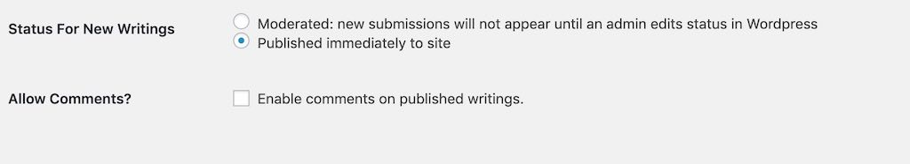

You can also choose the "status for new writings" as "publish immediately" and there are no checks and balances--the writing goes right up and is publicly visible immediately. Immediate gratification goes a long way. Note though, that because of the hollow tunnel this might create, this option works best with an access code as described above in place--right Lassie!?

Check the **Allow Comments** box to add a standard blog comment field at the bottom of all published pieces. 

### Sort Options

The default settings are for typical blogs where newest content is displayed first. The sort options allow you to change that across the site- the home page and category/tag archives, as well as making that change only in certain areas.

**Date Published** is the default option, the order is **Descending**, or newest first, change to **Ascending** to have oldest items appear first. 

Change the sort otder to **Title** to... yes... sort items alphabetically by each item's title.  Use **Ascending** for alphabetical order (A-Z) or **Descending** to reverse (Z-A).

Use the **Sort Applies To** option to specify where the alternative sorting is applied (for example, just on tags archive, or just the home page).

#### Writing Form Settings

Enter the **Default Writing Prompt** field to pre-populate the field that visitors write use to compose their work. You can provide a prompt or set up a structure. The editor is now full rich text enabled (including images).

You can also set a minimum number of words required for publishing.

Most uses will ask visitors to upload an image to use as a header/featured image. Using the option for **Allow Uploads of Header Images** this can be required (default), optional, or not used. If heade images are not used, all archive/front views will have a simple grey background instead of an image. 

Under **Default Header Image** click **Set/Change Image** to open the Wordpress media editor to choose a default media header image. Drop an image that you wish to be used as a default one if a writer does not include one of their own. The `640 x 300` dimensions are a minimum size, and represent a reasonable aspect ratio for a header image. Larger is better; and the image will be cropped along the middle of the image.

You can now also set a limit for the file size upload.

Before choosing the image, be sure to add a caption (we suggest a creative commons license!) as this is what is used to display atop the image when published. Attribute and model attribution! FTW!

Once selected you will see a preview of your default image. Isn't Felix a nice looking dog?

Note that you can set a maximum size for uploaded images.

Also, you can now use **Use caption field for uploaded header images** to make captions for attribution of images required (default), optional, or not used on the form.

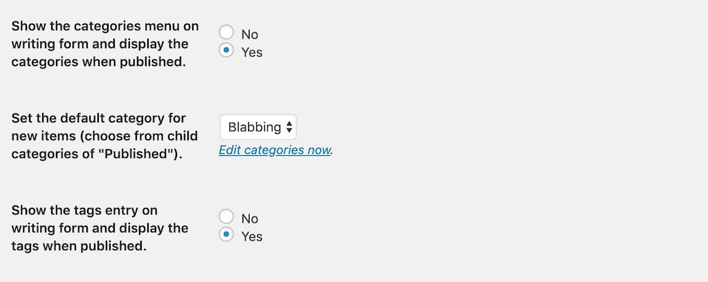

Disable **Show the categories menu on writing form and display** if you do not want writers or readers to use/see categories.

If you have not set up any categories, the **Default Category for New Writing** menu will not do much. You might want to save your options and go edit your **Writing Categories**. On activation the TRU Writer will pre-create two categories it uses to organize what is submitted and published.

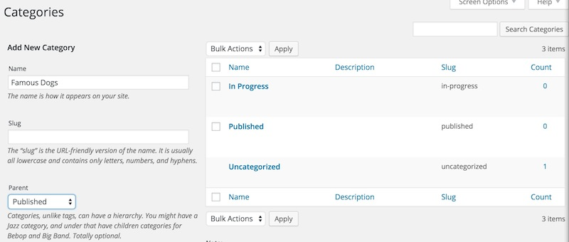

The `In Progress` category is where all submitted writings go if they need approval. Final Published items have their own ... `Published` category (big surprise there, eh?). If you want to give your writers a choice of categories to place their work, make sure any categories you create have `Published` as a parent.

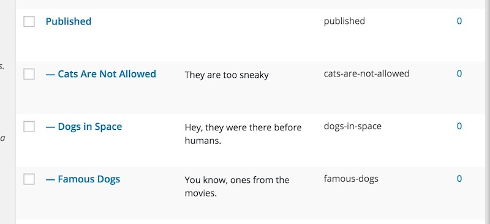

So we suggest making a few pre-set categories for a new site. As an Administrator you can always add new ones at any time. Any text you add as a description will be included on the writing form.

Disable **Show the tags entry on writing form and single items displays?** if you do not want writers or readers to use/see tags. Likewise use **Show the footer entry field on the writing form?** to use/disable the footer field writers can append to their works.

Enabling the email fields creates the option for users of your site to provide an address if they wish to have a special link sent to them that allows for post-publishing edits. (or be able to request one when published).

As an option you can enter a comma-separated list of domains to restruct the email addresses entered (e.g. if you wish students to use an school provided email address).

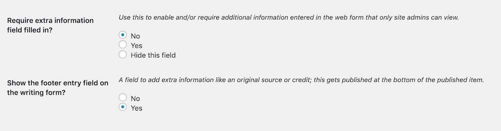

The **Extra Information Field** represents a place for them to add a message that is not part of the final published item, but that the administrator or editor might need to know, or might have requested. Perhaps if you are using this theme to host multiple sections of a class or course of study, you might want to populate the prompt for this field with something like "Include your name and course section" or, "name the dog that best represents you".

These end up in a **Custom Field** named "wEditorNotes," which you can view when editing the post in order to publish it (not the "quick edit"; the full monty "edit" please). You will need to open the Screen Options toggle at the top of the Wordpress Dashboard interface and click the box that makes the Custom Fields available. The information is also included in the notification emails announcing a new writing in need of approval.

#### Admin Settings

Enter in **Notification Emails** any email addresses who should be notified if new submissions; you have multiple ones if you separate them by a comma. Or leave blank if you never want to know what's going on in your site.

#### Twitter Settings

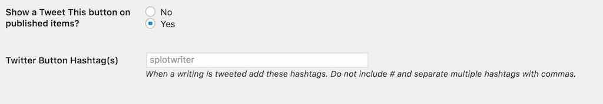

You can now choose to disable the Tweet This button on published items In enabled, you can enter one or more hashtags to be used when a published item is shared via the **Tweet This** button. Do not include "#" and separate multiple ones with commas

#### Estimated Reading Time Plugin
This plugin is optional, if installed and activated, it will add to all published works an estimate of the reading time based on a crude formula. If it is not installed, you will see the notes shown above. This plugin is available in the Wordpress repository, so it is an easy install.

#### Creative Commons / Rights Settings

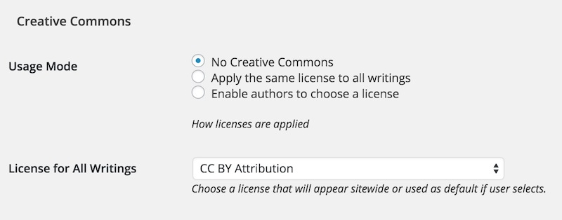

Creative Commons licenses or other usage rights (including copyright) can be attached to all works published on your site. Choose **Apply one license to all challenges** to place the same license on all works (a notice will be displayed on the writing form).

Or you can set the option to **Enable users to choose license** which places the same menu on the writing form so users can choose a license (or set to All Rights Reserved).

#### Import / Export TRU Writer Settings

The TRU Writer Options now features a tab with tools to export a sites settings as a JSON file than can be imported to another TRU Writer site. The only settings not transferred is the assigned Writer Page and the default Category (I expect these would be set up in a site clone?)

 

Some mild checks are done on importing a JSON file- errors will be generated if it is the wrong file type and if it was not generated by a TRU Writer site.

## Customize the Writing Form

You can customize the field labels and the descriptions of the form where people submit new pieces of writing. From anywhere viewing your site select **Writing Form** from the **Customize** menu. This opens the Customizer with the form page open.

Look for a special section just below **Site Identity** to open:

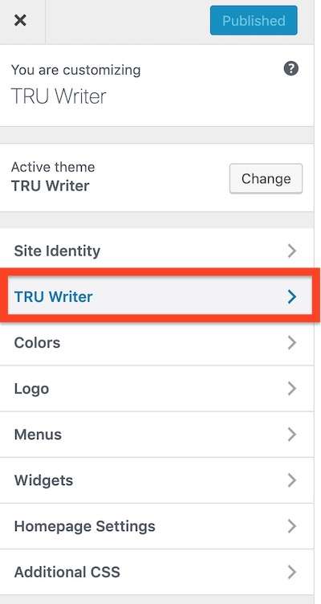

Then from this pane, open "Writing Form Prompts" tab

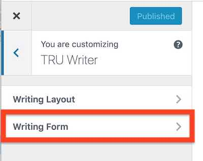

And then you will see a series of fields to edit for all form field elements. 

For each, you can edit the title/label of the field and the prompt that appears below. As you type in the customizer fields on the left, you will see a live preview on the right.

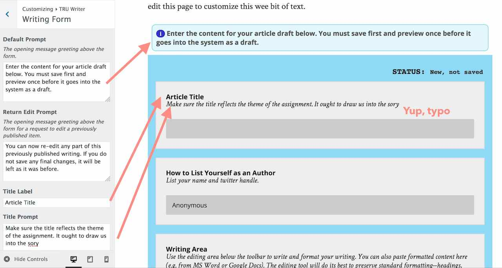

### Customize the Form and Button Colors

On your site navigate to the writer form, and activate the Wordpress Customizer from the admin bar. 

In the Customizer, under TRU Writer, look for a pane for **Form and Button Colors**:

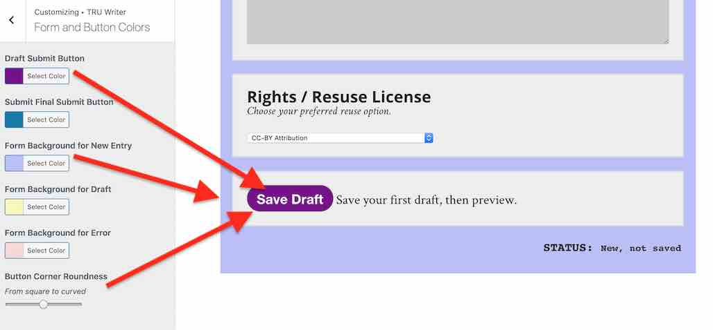

Use these settings to change the colors of the two buttons used on the Writing Form (one to update/submit drafts, the other for the final submission. There are also controls to modify the background colors on the form- for a new entry, for one that hs in draft, and a warning for form errors. 

Finally, you can modify the roundness of buttons. Why? Because we can

### Customize the Published Layout

You can  also customize the content layout. On your site navigate to any content post or page, and activate the Wordpress Customizer from the admin bar. From the **TRU Writer** pane, open **Published Layout**. 

Here you can choose from the Thin or Medium layout widths (Wide will only affect very large screens).

A small thing, but a corny heading of "SO IT WAS WRITTEN" was hardwired into the single post template; this is now something that can be changed in the Customizer: 

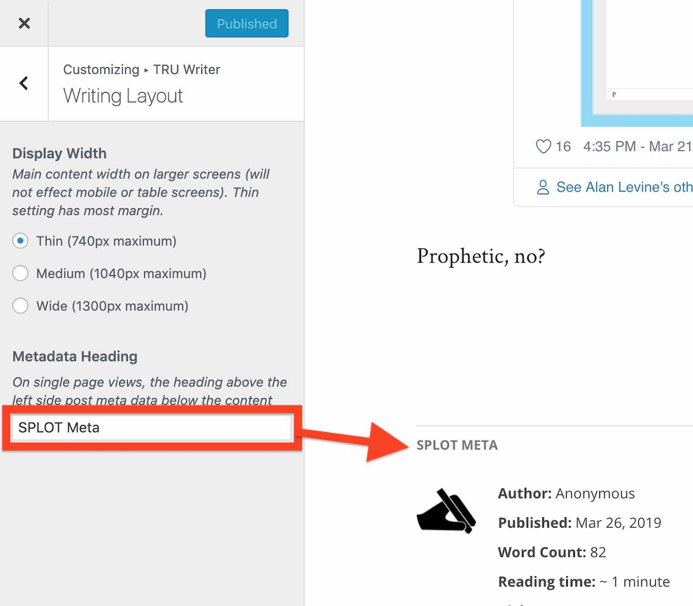

## Shortcodes

### Display All Tags

The basic use is just

`[taglist]`

which displays all tags used in alphabetical order, each linked to an archive, and the number of times used listed.

Optional parameters include:

* `number=10` limit to ten tags (default=0 or all tags)
* `show_count=false` hides the display of the number of times tag used (default=true)
* `mincount=2` will only show tags used 2 or more times (default=1)
* `orderby="count"` to order results by the number of times tag used (default="name")
* `order="DESC"` to list in descending order (default="ASC")
* `hide_empty=0` to list tags not used (default=1)

In use, this will display the 20 most used tags

`[taglist number=20 orderby="count" order="DESC"]`

### Count of Published items

Use [splotcount] to display the number of all published items

## Optional / Suggested Add-ons

### OpenGraph Tags for Social Media Sharing

If you would like Twitter Cards and Facebook shares to use the main images and provide a more complete display, install, activate, and configure a plugin like [Open Graph and Twitter Card Tags](https://wordpress.org/plugins/wonderm00ns-simple-facebook-open-graph-tags/). This adds the special [open graph tags](https://ogp.me/) to your site's pages to enable better social media share previews.

### Manage TinyMCE Editor

If you want to customize/re-arrange the buttons and controls on the rich text editor used by writers on your site, install [TinyMCE Advanced](https://wordpress.org/plugins/tinymce-advanced/). There is [a file in the theme](includes/tinymce-advanced-settings.txt)  with the typical settings for this plugin I use when I set up these sites.

You can copy and paste from that .txt file into the import field of the settings for TinyMCE Advanced (it's a small chunk of json).

## Updating The TRU Writer theme

Current version 

Compare this to the version of TRU Writer reported in your list of themes. Note that WordPress's reporting of themes being up to date does **not** reflect custom themes such as this one.  If what you see is less than the version above, here is how to update your copy of TRU Writer. 

If you [installed TRU Writer using the WP-Pusher plugin](https://github.com/cogdog/truwriter/blob/master/install.md#installing-tru-writer-in-one-click-with-wp-pusher-get-automatic-updates), updates can be made automatic or done in one click!

Otherwise, if you installed manually, updates are not too hard to do.

*This applies if you are running WordPress on your own web hosting platform where you have the ability to install themes and plugins. If you are on a shared/multisite WordPress server, please contact your friendly technical admins and request that they update TRU Writer.*

Custom (a.k.a unique!) WordPress themes like TRU Writer are installed by uploading a `.zip` file. They can now be updated the same way you installed it. It's that easy! 

Just [download the newest version of TRU Writer as a .zip](https://github.com/cogdog/truwriter/archive/refs/heads/master.zip). Now in your WordPress Dashboard, go to **Themes**, then **Add Theme** and finally **Upload Theme**. You will be asked to confirm updating the theme with the newer version.  

When done, your site should report this current version as active.

## Got Questions

This is quite a lot to take in, but these options and settings have been designed to allow you to change the way your site works that other wise would require custom programming. They also reflect the feedback of other users of TRU Writer.

Please make use of the [Discussion space on GitHub](https://github.com/cogdog/truwriter/discussions/)! I am egaer to hear from you.

